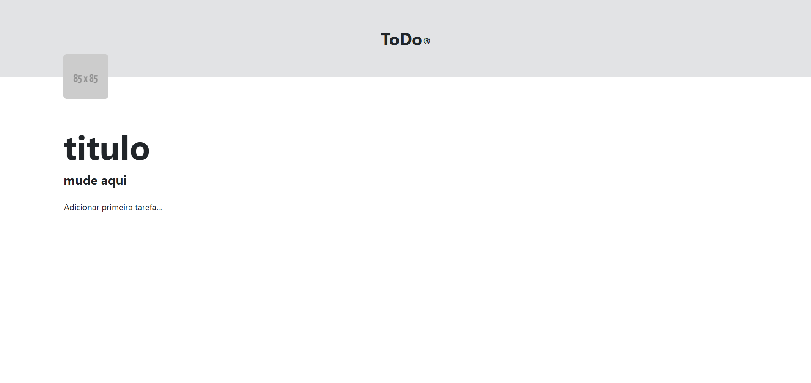

# Spring API + PostGreSQL 🐘



> Lorem

## Requisitos 💻

Antes de clonar o projeto e recomendado você ter os seguintes requisitos:

-   Necessario ter `lorem` instalado
-   Requisito `lorem` para clonar
-   Sua maquina `Windows, Linux ou Mac`.
-   Conhecimento basico `lorem`

## Tecnologias 🚀

As principais tecnologias e ferramentas utilizadas neste projeto são:

-   `lorem`: lorem.

## Como instalar 🚀

Windows, Linux e macOS

```
git clone lorem

cd lorem
```

### Contato 📞

-   Nome: Daniel Tenório
-   Email: danieltenorio2046@gmail.com
-   LinkedIn: [Meu LinkedIn](https://www.linkedin.com/in/daniel-tenório-6471b0244/)
